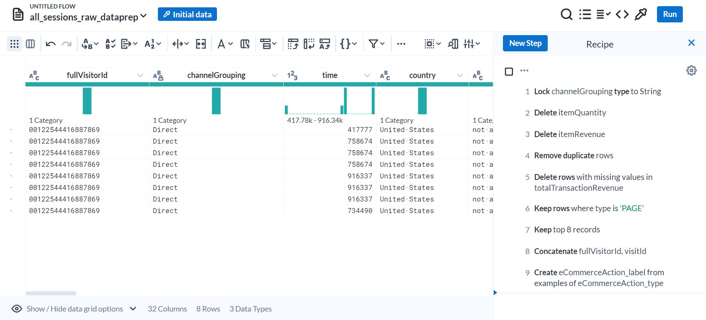

#  Data Preparation Project: E-commerce Dataset Analysis

## Project Description
This project is focused on enhancing the usability of an e-commerce dataset through meticulous data preparation and cleaning techniques. Several transformations were applied to optimize the dataset for subsequent analysis and modeling tasks:

 

By implementing these transformations, the project ensures that the e-commerce dataset is well-prepared and cleaned, setting the stage for in-depth analysis and modeling tasks. This enhanced dataset facilitates more accurate and meaningful insights into customer behavior, sales performance, and other critical aspects of the e-commerce domain.

## Thank you for your time and attention to these projects! 🚀
