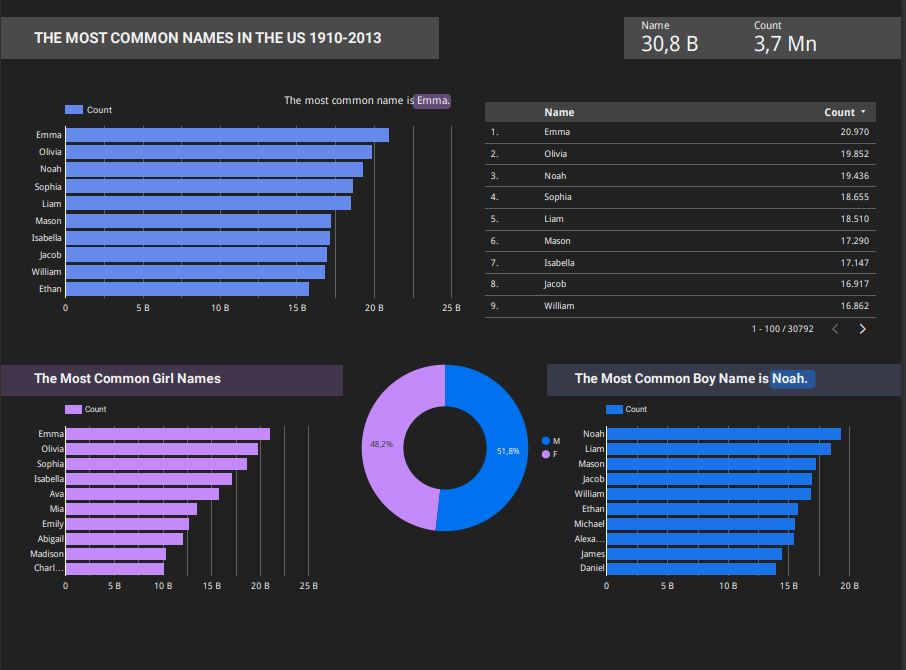

# Most Watched Movies and TV Shows Dataset Visualization on Looker Studio
## Overview:
This project explore the world of popular entertainment by analyzing trends in the most watched movies and TV shows, leveraging data from the "Visualization of Most Watched Movies and TV Shows" dataset sourced from Kaggle. Utilizing Looker Studio's visualization capabilities, I created interactive visualizations that offer insights into  preferences, and trends across different genres.

### [Please click here to review.](https://lookerstudio.google.com/u/0/reporting/3ac9b234-4e8c-4eb0-a4ba-83a6506b9720/page/ZpZqD)

# US Baby Names Dataset Visualization on Looker Studio
## Overview:
This project explores the trends in the most common names in the United States between 1910 and 2013 using data visualization techniques. Leveraging Looker Studio, I created interactive visualizations that provide insights into popular names, both overall and broken down by gender, over the past century.

### [Please click here to review.](https://lookerstudio.google.com/u/0/reporting/93f176cd-08ab-4a51-bfcb-9796ed7dcf66/page/l4PoD)

