# Predicting Visitor Purchases with BigQuery ML

## Overview
BigQuery ML (BigQuery machine learning) is a feature in BigQuery where data analysts can create, train, evaluate, and predict with machine learning models with minimal coding.
The Google Analytics Sample Ecommerce dataset that has millions of Google Analytics records for the Google Merchandise Store loaded into BigQuery. In this lab, We used this data to run some typical queries that businesses would want to know about their customers' purchasing habits.

### Objectives

-	Use BigQuery to find public datasets
-	Query and explore the ecommerce dataset
-	Create a training and evaluation dataset to be used for batch prediction
-	Create a classification (logistic regression) model in BigQuery ML
-	Evaluate the performance of your machine learning model
-	Predict and rank the probability that a visitor will make a purchase

#### Scenario
Your data analyst team exported the Google Analytics logs for an ecommerce website into BigQuery and created a new table of all the raw ecommerce visitor session data for you to explore. Using this data, you'll try to answer a few questions.

- Question: Out of the total visitors who visited our website, what % made a purchase?
  
 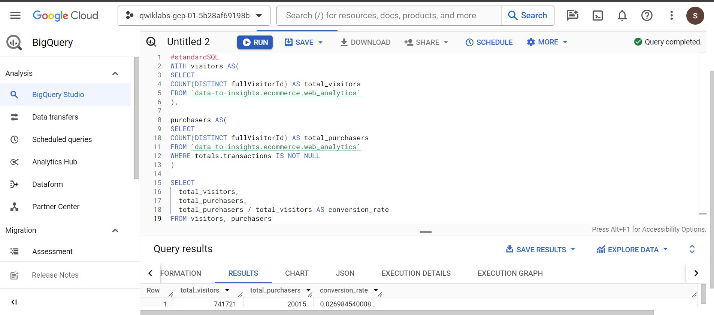

- Question: What are the top 5 selling products?

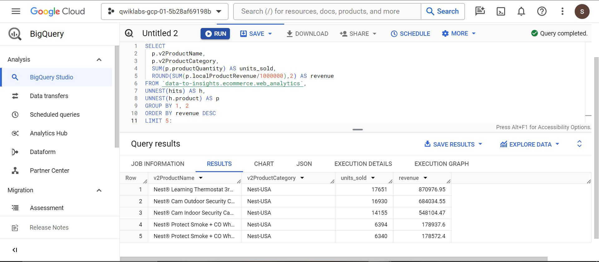

- Question: How many visitors bought on subsequent visits to the website?

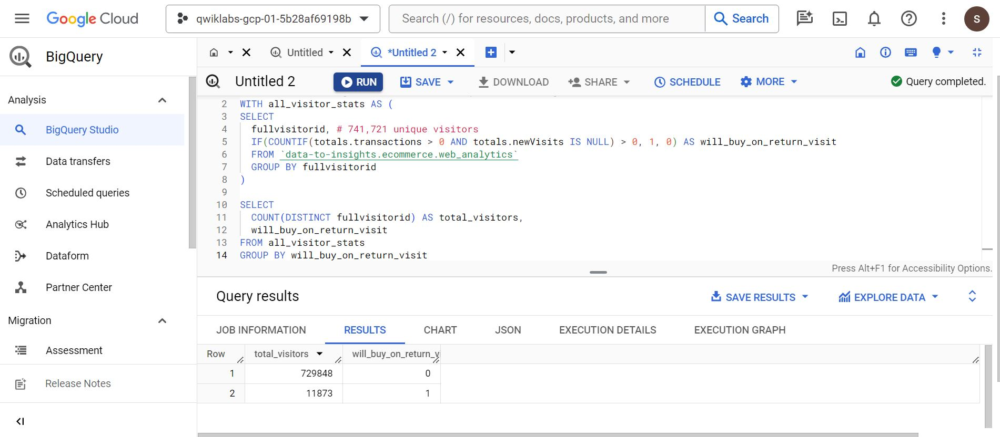

Analyzing the results, we can see that (11873 / 729848) = 1.6% of total visitors will return and purchase from the website. This includes the subset of visitors who bought on their very first session and then came back and bought again.

Your team decides to test whether these two fields are good inputs for your classification model:
-	totals.bounces (whether the visitor left the website immediately)
-	totals.timeOnSite (how long the visitor was on our website)

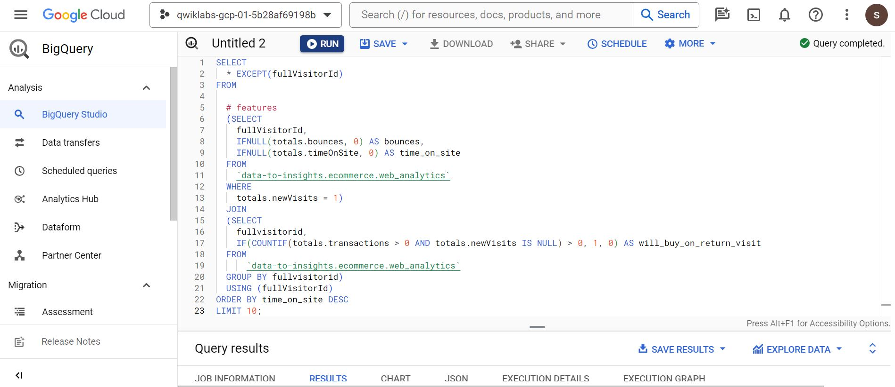
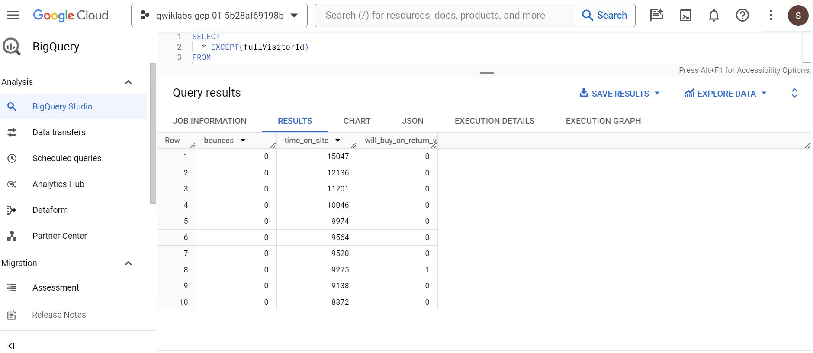

- Question: Looking at the initial data results, do you think time_on_site and bounces will be a good indicator of whether the user will return and purchase or not?
Answer: It's often too early to tell before training and evaluating the model, but at first glance out of the top 10 time_on_site, only 1 customer returned to buy, which isn't very promising. Let's see how well the model does.

In BigQuery ML, roc_auc is simply a queryable field when evaluating your trained ML model.

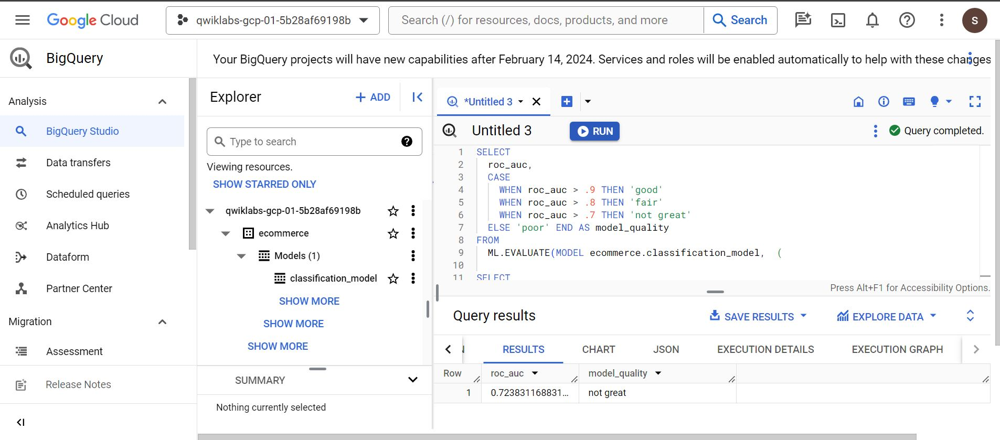

After evaluating  our model we get a roc_auc of 0.72, which shows that the model has not great predictive power. Since the goal is to get the area under the curve as close to 1.0 as possible, there is room for improvement.

There are many more features in the dataset that may help the model better understand the relationship between a visitor's first session and the likelihood that they will purchase on a subsequent visit.
We added some new features and create a second machine learning model called classification_model_2:

```sql
CREATE OR REPLACE MODEL `ecommerce.classification_model_2`
OPTIONS
  (model_type='logistic_reg', labels = ['will_buy_on_return_visit']) AS

WITH all_visitor_stats AS (
SELECT
  fullvisitorid,
  IF(COUNTIF(totals.transactions > 0 AND totals.newVisits IS NULL) > 0, 1, 0) AS will_buy_on_return_visit
  FROM `data-to-insights.ecommerce.web_analytics`
  GROUP BY fullvisitorid
)

# add in new features
SELECT * EXCEPT(unique_session_id) FROM (

  SELECT
      CONCAT(fullvisitorid, CAST(visitId AS STRING)) AS unique_session_id,

      # labels
      will_buy_on_return_visit,

      MAX(CAST(h.eCommerceAction.action_type AS INT64)) AS latest_ecommerce_progress,

      # behavior on the site
      IFNULL(totals.bounces, 0) AS bounces,
      IFNULL(totals.timeOnSite, 0) AS time_on_site,
      totals.pageviews,

      # where the visitor came from
      trafficSource.source,
      trafficSource.medium,
      channelGrouping,

      # mobile or desktop
      device.deviceCategory,

      # geographic
      IFNULL(geoNetwork.country, "") AS country

  FROM `data-to-insights.ecommerce.web_analytics`,
     UNNEST(hits) AS h

    JOIN all_visitor_stats USING(fullvisitorid)

  WHERE 1=1
    # only predict for new visits
    AND totals.newVisits = 1
    AND date BETWEEN '20160801' AND '20170430' # train 9 months

  GROUP BY
  unique_session_id,
  will_buy_on_return_visit,
  bounces,
  time_on_site,
  totals.pageviews,
  trafficSource.source,
  trafficSource.medium,
  channelGrouping,
  device.deviceCategory,
  country
);

```
Evaluated this new model to see if there is better predictive power.

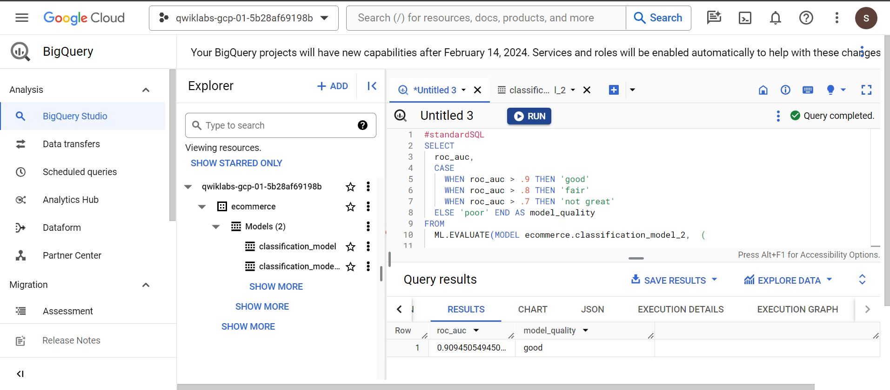

With this new model we now get a roc_auc of 0.91 which is significantly better than the first model.

Next we will write a query to predict which new visitors will come back and make a purchase.

```sql
SELECT
*
FROM
  ml.PREDICT(MODEL `ecommerce.classification_model_2`,
   (

WITH all_visitor_stats AS (
SELECT
  fullvisitorid,
  IF(COUNTIF(totals.transactions > 0 AND totals.newVisits IS NULL) > 0, 1, 0) AS will_buy_on_return_visit
  FROM `data-to-insights.ecommerce.web_analytics`
  GROUP BY fullvisitorid
)

  SELECT
      CONCAT(fullvisitorid, '-',CAST(visitId AS STRING)) AS unique_session_id,

      # labels
      will_buy_on_return_visit,

      MAX(CAST(h.eCommerceAction.action_type AS INT64)) AS latest_ecommerce_progress,

      # behavior on the site
      IFNULL(totals.bounces, 0) AS bounces,
      IFNULL(totals.timeOnSite, 0) AS time_on_site,
      totals.pageviews,

      # where the visitor came from
      trafficSource.source,
      trafficSource.medium,
      channelGrouping,

      # mobile or desktop
      device.deviceCategory,

      # geographic
      IFNULL(geoNetwork.country, "") AS country

  FROM `data-to-insights.ecommerce.web_analytics`,
     UNNEST(hits) AS h

    JOIN all_visitor_stats USING(fullvisitorid)

  WHERE
    # only predict for new visits
    totals.newVisits = 1
    AND date BETWEEN '20170701' AND '20170801' # test 1 month

  GROUP BY
  unique_session_id,
  will_buy_on_return_visit,
  bounces,
  time_on_site,
  totals.pageviews,
  trafficSource.source,
  trafficSource.medium,
  channelGrouping,
  device.deviceCategory,
  country
)

)

ORDER BY
  predicted_will_buy_on_return_visit DESC;

```

We can see three newly added fields:
-	predicted_will_buy_on_return_visit: whether the model thinks the visitor will buy later (1 = yes)
-	predicted_will_buy_on_return_visit_probs.label: the binary classifier for yes / no
-	predicted_will_buy_on_return_visit_probs.prob: the confidence the model has in it's prediction (1 = 100%)

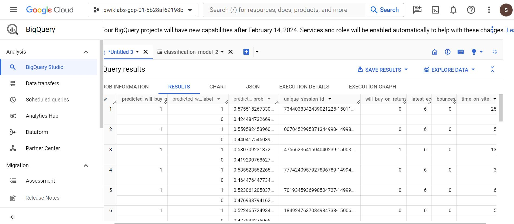


## Results
-	Of the top 6% of first-time visitors (sorted in decreasing order of predicted probability), more than 6% make a purchase in a later visit.
-	These users represent nearly 50% of all first-time visitors who make a purchase in a later visit.
-	Overall, only 0.7% of first-time visitors make a purchase in a later visit.
-	Targeting the top 6% of first-time increases marketing ROI by 9x vs targeting them all!

Though our linear classification (logistic regression) model performed well after feature engineering, it may be too simple of a model to fully capture the relationship between the features and the label. Used the same dataset and labels as we  created the model ecommerce.classification_model_2,  create a XGBoost Classifier.

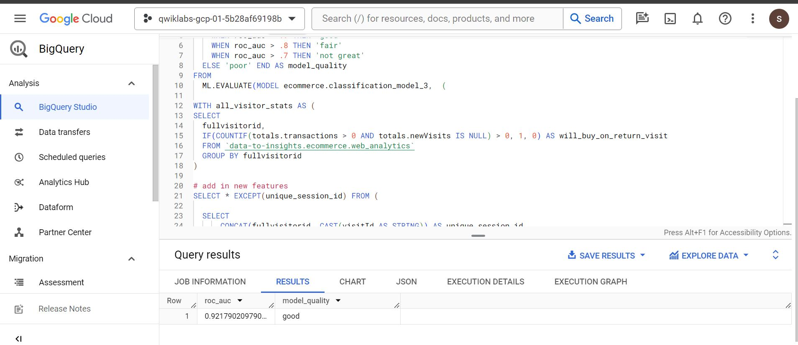

Our roc_auc has increased by about .02 to around .94! Let’s finish up by generating predictions with our improved model and see how they compare to those we generated before. 

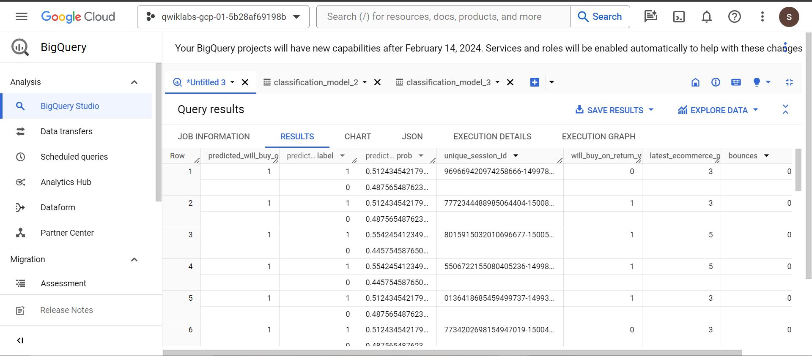

### ROC Curve Methodology

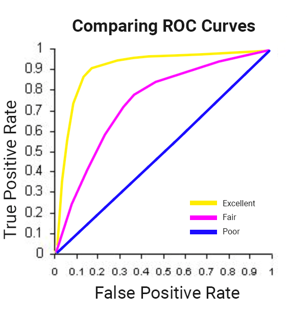

### First Model's ROC Curve:
 
 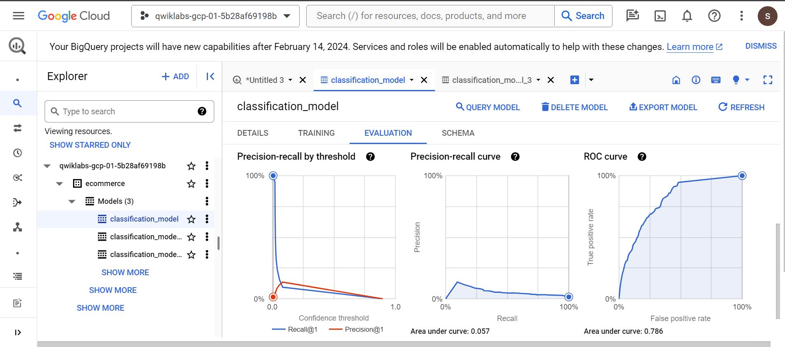
 
### Second Model's ROC Curve:
 
 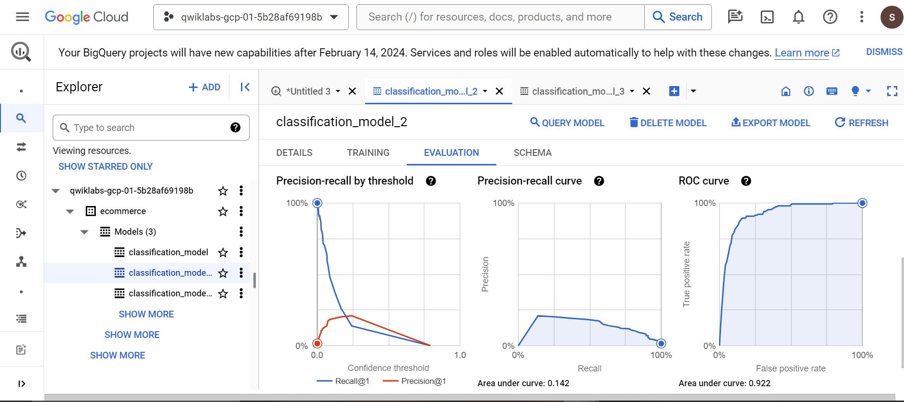
 
### Third Model's ROC Curve:
 
 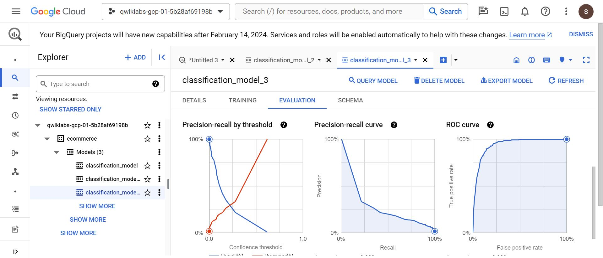

## Thank you for your time and attention to these projects! 🚀

