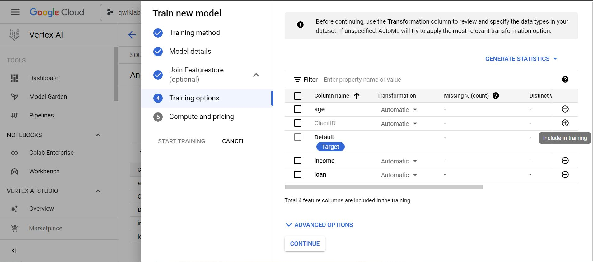
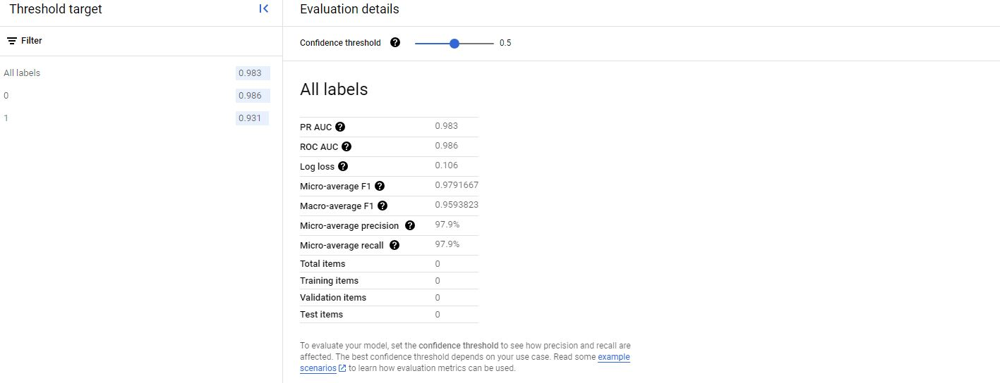
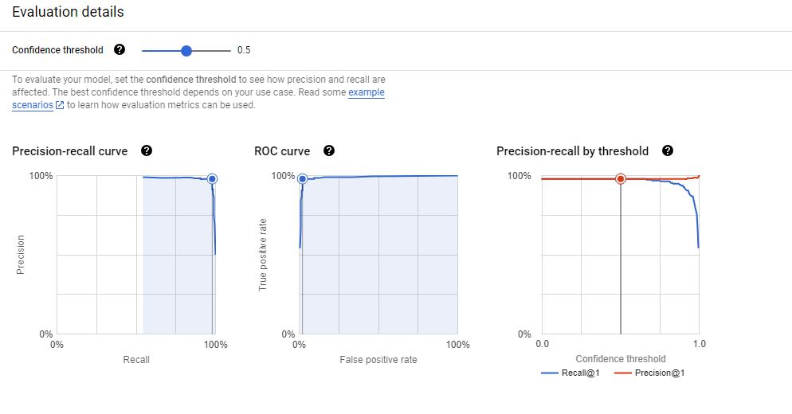
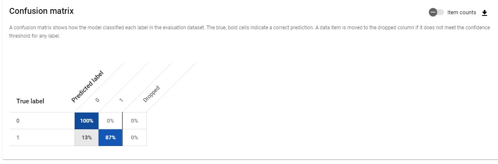
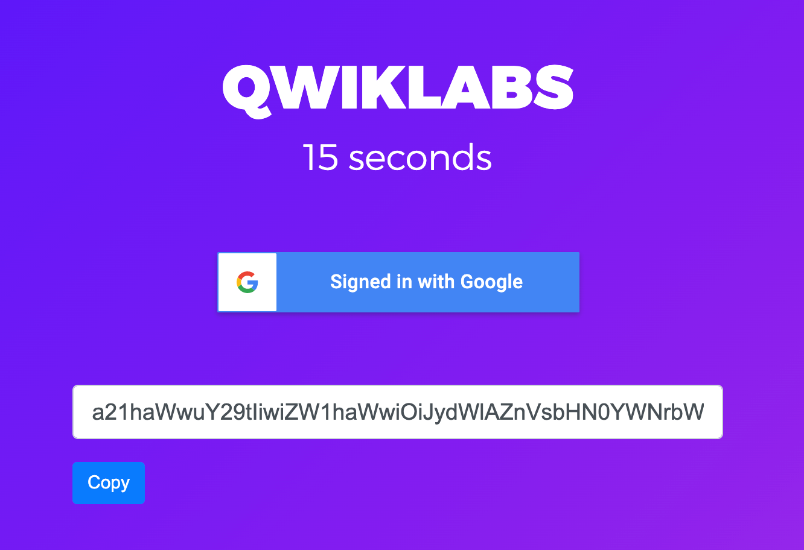
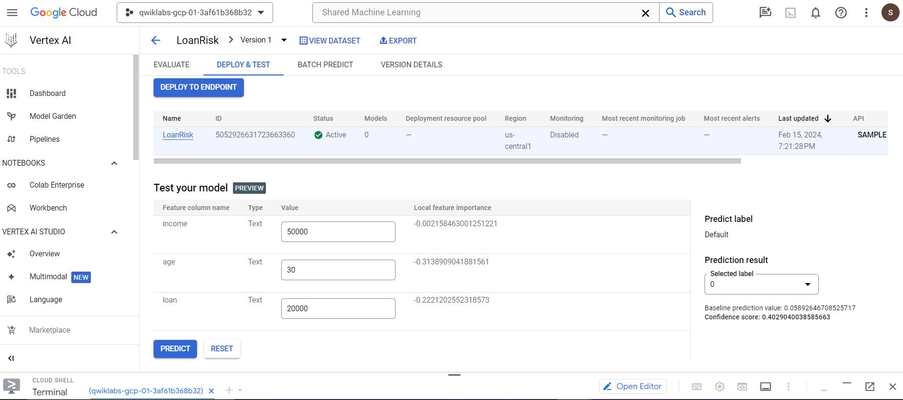

# Vertex AI Predicting Loan Risk with AutoML

## Overview 
This lab uses Vertex AI, the unified AI platform on Google Cloud to train and deploy a ML model. Vertex AI offers two options on one platform to build a ML model: a codeless solution with AutoML and a code-based solution with Custom Training using Vertex Workbench. We used AutoML in this lab.
In this lab we build a ML model to determine whether a particular customer will repay a loan.

### Objectives

-	Upload a dataset to Vertex AI.
-	Train a machine learning model with AutoML.
-	Evaluate the model performance.
-	Deploy the model to an endpoint.
-	Get predictions.

### Let's Start!

- Trained our model.

 

 - Evaluated the model performance (demonstration only).

### The Precision/Recall Curve

 
 

### The Confusion Matrix

### The Feature Importance

These feature importance values could be used to help you improve your model and have more confidence in its predictions. We might decide to remove the least important features next time you train a model or to combine two of the more significant features into a feature cross to see if this improves model performance.

### SML Bearer Token

To allow the pipeline to authenticate, and be authorized to call the endpoint to get the predictions, we will need to provide your Bearer Token.

### Get Predictions

In this case, assuming that the person's income is 50,000, age 30, and loan 20,000, the model predicts that this person will repay the loan.

## Thank you for your time and attention to these projects! 🚀

 

 
